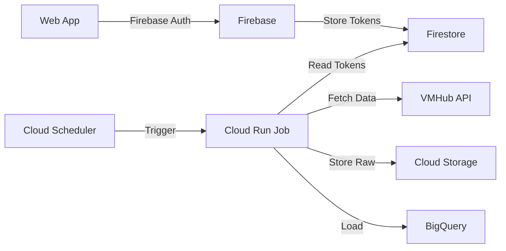

# VMHub Infrastructure as Code

## Overview
Infrastructure as code for the VMHub Data Pipeline using Terraform and Google Cloud Platform.

## Architecture Diagram


## Project Structure
```
terraform/
├── environments/          
│   ├── dev/              # Development environment
│   │   ├── main.tf       # Main configuration
│   │   ├── variables.tf  # Variable definitions
│   │   └── terraform.tfvars # Variable values
│   └── prod/             # Production environment
├── modules/              
│   ├── base-infrastructure/  # Project-level setup
│   │   ├── main.tf
│   │   ├── variables.tf
│   │   └── outputs.tf
│   ├── service-account/     # Service account & IAM
│   │   ├── main.tf
│   │   ├── variables.tf
│   │   └── outputs.tf
│   └── sync-job/           # Per-CNPJ resources
│       ├── main.tf
│       ├── variables.tf
│       └── outputs.tf
```

## Resources Created Per CNPJ

| Resource | Naming Convention | Purpose |
|----------|------------------|----------|
| Cloud Run Job | `vmhub-sync-{cnpj}` | Executes data sync |
| Storage Bucket | `vmhub-data-semantc-ai-{cnpj}-{env}` | Stores raw data |
| BigQuery Dataset | `CNPJ_{cnpj}_RAW` | Data warehouse |
| Cloud Scheduler | `vmhub-sync-schedule-{cnpj}` | Triggers sync job |

## Prerequisites

1. Google Cloud Project
```bash
gcloud config set project PROJECT_ID
```

2. Required APIs
```bash
gcloud services enable cloudresourcemanager.googleapis.com
gcloud services enable serviceusage.googleapis.com
gcloud services enable run.googleapis.com
```

3. Firebase Project with:
   - Authentication enabled
   - Firestore database created

## Setup Instructions

1. Create Terraform state bucket:
```bash
gsutil mb -l us-central1 gs://tf-state-semantc-ai-dev
gsutil versioning set on gs://tf-state-semantc-ai-dev
```

2. Initialize Terraform:
```bash
cd environments/dev  # or prod
terraform init
```

3. Plan changes:
```bash
terraform plan
```

4. Apply changes:
```bash
terraform apply
```

## Module Details

### Base Infrastructure
- Enables required GCP APIs
- Creates Artifact Registry repository
- Sets up logging and monitoring
- Configures basic project resources

### Service Account
- Creates main service account
- Sets up IAM permissions for:
  - Cloud Run execution
  - Storage access
  - BigQuery operations
  - Firestore reading
  - Cloud Scheduler operations

### Sync Job
- Creates per-CNPJ resources
- Configures Cloud Run job
- Sets up data storage
- Establishes scheduling

## Environment Variables
Required in Firestore per CNPJ:
```json
{
  "vmhub_token": "xxx",
  "whatsapp_token": "xxx"
}
```

## Security Considerations
- Tokens stored in Firestore
- Service account least-privilege access
- Bucket-level access control
- Dataset-level permissions

## Monitoring & Logging
- Custom error metrics
- Job failure alerts
- Execution logs retention
- Performance monitoring

## Maintenance
- Regular state backup
- Token rotation process
- Log analysis
- Resource cleanup

## Deployment Process
1. Dev environment testing
2. Staging verification
3. Production deployment
4. Post-deployment validation

## Contributing
1. Create feature branch
2. Update terraform configurations
3. Test in dev environment
4. Submit pull request

## Support
For issues and support:
- Infrastructure: DevOps Team
- Data Pipeline: Data Engineering Team
- User Management: Support Team

---
Built with ❤️ using Terraform and Google Cloud Platform