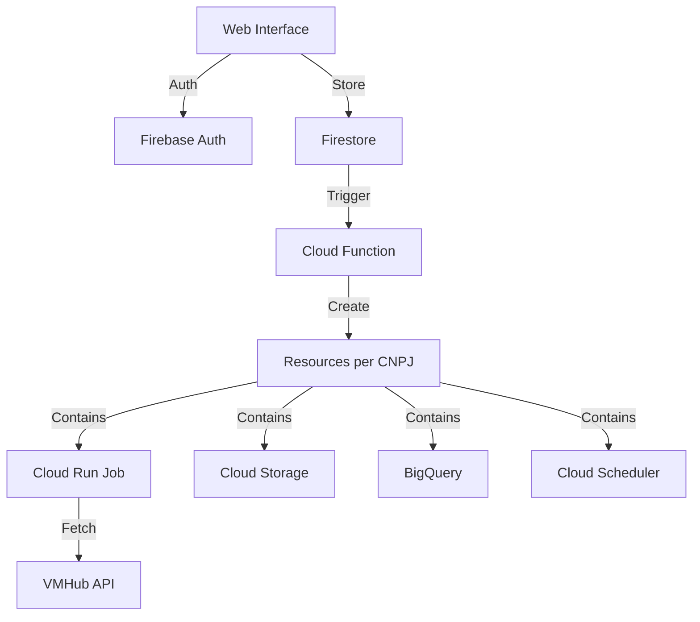

# VMHub Infrastructure as Code

## Overview
Infrastructure automation for VMHub Data Pipeline using Terraform and Google Cloud Platform, with dynamic resource provisioning via Cloud Functions.

## Architecture Diagram


## Project Structure
```
terraform/
├── environments/          
│   ├── dev/              # Core infrastructure - development
│   │   ├── main.tf       
│   │   ├── variables.tf  
│   │   └── terraform.tfvars
│   └── prod/             # Core infrastructure - production
├── modules/              
│   ├── base-infrastructure/  # Project-level resources
│   │   ├── main.tf          # APIs, monitoring, etc.
│   │   ├── variables.tf
│   │   └── outputs.tf
│   └── service-account/      # IAM and permissions
│       ├── main.tf
│       ├── variables.tf
│       └── outputs.tf
└── functions/            
    └── provisioner/          # Dynamic CNPJ resource creation
        ├── src/
        │   ├── index.js      # Cloud Function entry point
        │   ├── infrastructure.js  # Resource provisioning
        │   └── config.js     # Configuration
        ├── package.json
        └── terraform/        # Function deployment
            ├── main.tf
            ├── variables.tf
            └── outputs.tf
```

## Components

### Core Infrastructure (Terraform)
- Enables required GCP APIs
- Sets up service accounts and IAM permissions
- Configures monitoring and logging
- Manages base project resources

### Dynamic Provisioner (Cloud Function)
Automatically creates per-CNPJ resources when new users configure their tokens:
- Cloud Storage bucket for raw data
- BigQuery dataset for analytics
- Cloud Run job for data sync
- Cloud Scheduler for automated syncs

## Resource Naming Conventions

| Resource | Pattern | Example |
|----------|---------|---------|
| Storage Bucket | `vmhub-data-semantc-ai-{cnpj}-{env}` | `vmhub-data-semantc-ai-12345678000199-dev` |
| BigQuery Dataset | `CNPJ_{cnpj}_RAW` | `CNPJ_12345678000199_RAW` |
| Cloud Run Job | `vmhub-sync-{cnpj}` | `vmhub-sync-12345678000199` |
| Cloud Scheduler | `vmhub-sync-schedule-{cnpj}` | `vmhub-sync-schedule-12345678000199` |

## Setup Instructions

1. Deploy Core Infrastructure:
```bash
# Initialize and apply core infrastructure
cd terraform/environments/dev  # or prod
terraform init
terraform apply
```

2. Deploy Provisioning Function:
```bash
# Install dependencies
cd terraform/functions/provisioner
npm install

# Deploy function
cd terraform
terraform init
terraform apply
```

3. Set up Firestore structure:
```
users/
└── {userId}/
    └── tokens/
        └── {cnpj}/
            ├── vmhub_token: string
            ├── whatsapp_token: string
            ├── status: string
            └── created_at: timestamp
```

## Workflow

1. User Flow:
   - User registers via web interface
   - Configures CNPJ and tokens
   - Data saved to Firestore

2. Provisioning Flow:
   - Cloud Function triggered by Firestore write
   - Creates required resources for CNPJ
   - Updates status in Firestore
   - Triggers initial data sync

3. Operational Flow:
   - Cloud Scheduler triggers periodic syncs
   - Data stored in Cloud Storage
   - Data loaded to BigQuery
   - WhatsApp notifications sent based on data

## Monitoring

- Cloud Function execution logs
- Resource provisioning status in Firestore
- Sync job execution status
- Error metrics and alerts

## Security

- Firebase Authentication
- Service account least-privilege access
- Firestore security rules
- Resource isolation per CNPJ

## Development

1. Local Development:
```bash
cd terraform/functions/provisioner
npm install
npm run test  # if tests are set up
```

2. Deployment:
```bash
# Deploy infrastructure changes
cd terraform/environments/dev
terraform apply

# Deploy function changes
cd terraform/functions/provisioner/terraform
terraform apply
```

## Contributing

1. Create feature branch
2. Make changes
3. Test in dev environment
4. Submit pull request

## Support
For issues and support:
- Infrastructure: DevOps Team
- Data Pipeline: Data Engineering Team
- Web Interface: Frontend Team

---
Built with ❤️ using Terraform, Google Cloud Platform, and Firebase